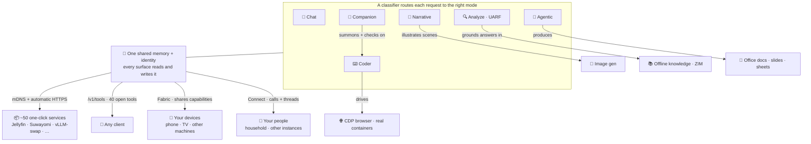

<p align="center">
  
</p>

<h1 align="center">Augmentum</h1>

<p align="center">
  <strong>A self-hosted personal AI platform for chat, voice, avatars, tools, knowledge, media, and coding — all sharing one local memory.</strong>
</p>

<p align="center">
  <a href="#run-it">Run it</a> ·
  <a href="#what-it-can-do">What it can do</a> ·
  <a href="#documentation">Docs</a> ·
  <a href="#security">Security</a> ·
  <a href="#support--continuity">Support</a>
</p>

<p align="center">
  <code>AGPL-3.0</code>
  <code>Docker Compose</code>
  <code>Python 3.11</code>
  <code>SQLite</code>
  <code>OpenAI/Ollama-compatible</code>
  <code>No telemetry</code>
</p>

Augmentum is not a proxy. It serves its own models, ships its own multi-surface
web UI, and speaks Ollama / OpenAI-compatible APIs so existing clients can plug
in. The shared context layer — conversations, generated artifacts, browse
history, characters, code, media, and memory — stays on your hardware and grows
with use.

*Ad Augmentum* -- Toward Augmentation.

## At a glance

| Layer | What Augmentum brings together |
| --- | --- |
| **Interfaces** | Chat, voice, 3D VRM avatars, narrative sessions, browse, media, cast, and a full web UI |
| **Intelligence** | Local model serving, routed processing modes, open tools, image generation, offline knowledge, and artifacts |
| **Agency** | Coder workspaces, long-running agentic tasks, browser control, tests, terminals, and document generation |
| **Continuity** | One local memory/persona layer shared across modes, users, devices, media, and generated work |
| **Sovereignty** | Self-hosted Docker deployment, multi-tenant auth, local storage, no analytics, no telemetry, no phone-home |

## Why Augmentum

The self-hosted AI world is full of excellent single-purpose tools: one serves
models, another is a chat frontend, another does roleplay, another manages
media. Augmentum's thesis is different: your chat, code, voice, browse history,
characters, generated documents, and media should live in **one local store that
every surface can read from**, and every device on your network should draw from
**one shared pool of capabilities**.

If you want the best-in-class version of one isolated feature, use the
specialist. If you want a single, private AI that remembers across silos and
follows you across devices, Augmentum is built for that shape of life.

## Project status

**Honest status: capable, broad, and early.** Augmentum is written and
self-tested by one person, used daily by its author, and has not yet had external
peer review or a third-party security audit. Treat it as a serious beta:
substantial and usable on the author's setup, but still waiting for the review,
testing, and bug reports that only a community can provide.

| Tier | Included surfaces | Expectation |
| --- | --- | --- |
| **Proven on author hardware** | API compatibility, routed modes, multi-tenant auth, model serving, tools/artifacts, image generation, voice, cast, and offline knowledge | Works on the author's daily setup; broader hardware and deployment feedback is welcome |
| **Opt-in beta** | Autonomous companion, game agent, Connect, self-editing, language learning, VR/XR, Fabric peering, game streaming, and memory/dream loops | Ambitious, functional, explicitly gated, and still unfinished |

Licensed **AGPL-3.0** — self-host freely; network use carries the copyleft.

## Run it

Recommended path, CPU or NVIDIA GPU:

```bash
# macOS & Linux
git clone https://github.com/AugmentumHQ/Augmentum augmentum
cd augmentum
./setup.sh
```

```powershell
# Windows PowerShell
git clone https://github.com/AugmentumHQ/Augmentum augmentum
cd augmentum
.\setup.bat
```

The setup wizard detects NVIDIA hardware, lets you choose CPU/GPU and optional
services, writes `.env` + `.augmentum.conf`, then asks **Start Augmentum now?**
with **yes** as the default.

Then open **https://localhost:6443** and accept the local certificate warning
once. Plain HTTP is also available at **http://localhost:6100/ui**. The first
account you create becomes the admin; after that, registration closes.

## What it can do

Augmentum isn't a bundle of separate tools — it's **one AI with many surfaces
that share a single memory and reach into each other.** What you say in voice
shows up in chat; a story illustrates its own scenes; an analysis grounds itself
in an offline encyclopedia; the companion can spin up a coder workspace and check
on the run. The magic isn't any one feature — it's how they connect, and how each
one gives you an "oh, *that's* how I'd use it" moment.



### The modes — and the one that ties them together

A built-in classifier reads each request and picks the mode that fits; or you
force one with a one-letter prefix. They all read and write the same memory.

- **💬 Chat** — plain conversation, the fast default. Type, or **speak** through
  a full voice pipeline: streaming STT with voice-activity + smart-turn detection,
  denoising, a pronunciation lexicon, and natural multi-engine TTS with emotion
  and prosody. Train your own **wake word** from a handful of samples. Or talk to
  a **3D VRM avatar** with IK, Rapier ragdoll physics, phoneme lip-sync, and poses.
- **🔍 Analyze (UARF)** — a structured reasoning pipeline for hard questions:
  assess → gather (web search, fetch) → reason (run code, verify math) →
  cross-check → conclude. Grounds itself in your offline knowledge packs.
- **📖 Narrative** — creative writing and roleplay with character cards, tracked
  world state, plot threads, and a lorebook — and **scenes illustrate themselves**
  as the story unfolds.
- **🎯 Agentic** — long-running, goal-directed work that plans, uses tools, and
  produces **real deliverables**: `.docx`, `.pptx`, `.xlsx`, `.epub`, charts,
  e-books — files that open in Office, not just markdown.
- **⌨️ Coder** — a full IDE-agent platform in a **real container** (~30 tools):
  reads/writes/edits, real terminal sessions, tests, git, a **CDP browser it can
  see and click**, live dev-server **preview proxying**, per-workspace permission
  policy, a held-out verification gate, a **bug-finder**, and sub-agent dispatch.
  Speaks ACP, so it both drives and is driven by external agents — point Claude
  Code / Cursor / Cline at it, or use the built-in one.
- **🤝 Companion** *(beta, off by default)* — not a chatbot but a full
  autonomous agent, and the connective tissue between everything else. It can
  dispatch **any** of the above as a subagent — summon a coder workspace and check
  on its run, kick off research, illustrate something. Under the hood it runs
  affect / drive / energy states, initiative and sleep-wake behavior loops,
  standing tasks, accumulating skills, and a safety floor — growing with you
  through its own memory, personality, and dream loops.

### One memory, every surface — and beyond one box

Conversations, facts, characters, code, browse history, and media live in **one
local store** every mode reads from. That's the compounding part: the more you
use it, the more it knows *across silos* — something no siloed commercial product
can do. Multiple users share one box, each fully isolated (Argon2id, per-user
scoping enforced everywhere, fail-closed auth).

Two subsystems reach past a single machine — one shares **capabilities**, the
other connects **people**:

- **Fabric** *(opt-in)* — cross-instance capability federation. Every Augmentum
  node advertises what it can serve and borrows what it can't, so a weaker device
  runs on a stronger one's hardware. It federates **seven capability kinds** —
  LLM inference, image generation, TTS, STT, knowledge search, code execution,
  and cast rendering — over a single channel: your tablet borrows your tower's
  GPU. Peers pair SSH-host-key-style, every request rides an **Ed25519-signed
  envelope**, and it's end-to-end encrypted with revocation and cost-aware
  routing. Default off — a solo install never runs a line of it.
- **Connect** *(beta)* — real peer-to-peer communication between your own
  instances and other people's: **WebRTC voice and video calls** (LiveKit + your
  own TURN) and **end-to-end-encrypted text threads with attachments**. Add
  contacts by decentralized identity (DID), see presence, search a directory, and
  hand out scoped **guest grants** for temporary visitors. Reachable from
  anywhere over Tailscale — no ports to open.

### Augmentum as your gateway *(Discover)*

Beyond its own capabilities, Augmentum is the front door to a **catalog of ~50
one-click services** across six categories — Providers, Add-ons, Files &
Productivity, Media, Networking, and Automation. Install something like
**Jellyfin, Suwayomi, or a vLLM model-swap server** from the Discover panel and
Augmentum wires it up for you: **mDNS discovery + automatic HTTPS**, reachable
through one trusted gate instead of a dozen ports and self-signed-cert warnings.
It also plugs into media you already run — Jellyfin, Emby, Plex, Audiobookshelf.

### Everything the models can do — as open tools

Augmentum exposes **40 tools over a simple `/v1/tools` API** (the Augmentum Tool
Protocol): calculator, web search, `python`, math verification, memory
recall/store, browser control, document parsing, image search, deep research, and
more. **Any** client can call them — not just Augmentum's own modes — so the
capabilities you build up become reusable primitives everywhere. It's an MCP
server *and* an MCP client, too: Augmentum becomes a tool for Claude Desktop /
Cursor, and external MCP tools appear inside its chat and coder.

### Works with no internet at all

Attach Wikipedia and other reference corpora as offline **knowledge packs**
(ZIM / augpack) for grounded answers and a local, browseable encyclopedia —
fully offline.

### In the living room, and on your terms

Cast **any surface** to your TV — chat, avatar, audio, video, comics, or a game.
Friends join a game from a QR code with named guest profiles and their own saves.
The **game agent plays real emulators by *looking* at the screen** — no scripting.
And it all runs on your terms: a bundled reverse proxy mints a **local CA for
real HTTPS**
(no browser warnings, no Let's Encrypt dance), Web Push notifications reach you
with the tab closed, one Docker command starts it (CPU or GPU), and there's **no
telemetry, no analytics, no phone-home** — data leaves your machine only when you
configure a cloud provider yourself.

> There's more than fits here — calendar, language learning, XR, a marketplace,
> personality/dream loops, self-editing, and more, most gated behind explicit
> opt-in settings. The point isn't the length of the list; it's that it's all
> **one system, sharing one memory, on hardware you own.**

> **Sandboxing note:** code the assistant runs executes in a separate container
> with a read-only filesystem, dropped capabilities, network isolation, and
> memory/PID/timeout caps — not on your host.

## Beyond the browser — phone & TV

The web UI is the primary surface, but Augmentum also reaches your phone and TV.
Both are **more beta than the server**; the native pieces are **developer
installs** via Android Studio (no app-store release yet).

- **Augmentum for Android** *(separate repo)* — a native Kotlin/Compose phone
  client (not a wrapped WebView) that pairs with your home instance as a fabric
  peer: same chats, voice, memory, knowledge, and companion. It calls the same
  `/api` surfaces as the web UI, so it stays closely in sync. Honest rough edge:
  the on-device assistant is a heavy battery draw and still beta.
- **The TV, via cast** *(in this repo)* — the living-room experience is
  **cast-based**: send any surface (chat, avatar, comics, audio, live TV, or a
  game) to a screen from the web UI or your phone. The cast receiver runs in any
  browser; an optional native **Android TV receiver app**
  (`augmentum/cast/android-tv-receiver/`) gives you a dedicated always-on TV
  client — the most experimental piece of the three. Full build + sideload
  walkthrough: **[Android TV Receiver guide](docs/cast-android-tv.md)**.

Both are optional. The server and its bundled web UI are fully usable on their
own.

## Quick Start

### Recommended path — setup wizard

This is the most reliable path right now. It uses a real repo checkout, lets the
wizard choose sane CPU/GPU defaults from your hardware, writes `.env` +
`.augmentum.conf`, and starts Augmentum when you accept the final default.

Requires Docker with Compose. The standard option uses prebuilt images; the
contributor option builds locally.

```bash
# macOS & Linux
git clone https://github.com/AugmentumHQ/Augmentum augmentum
cd augmentum
./setup.sh
```

```powershell
# Windows PowerShell
git clone https://github.com/AugmentumHQ/Augmentum augmentum
cd augmentum
.\setup.bat
```

At the end, accept **Start Augmentum now? [Y/n]** to launch immediately. If you
answer no, start later with `./start.sh -d` or `start.bat -d`.

Open **https://localhost:6443** and accept the local certificate warning once.
Plain HTTP is also available at **http://localhost:6100/ui**. The first account
you create becomes the admin; after that, registration closes.

### Pull-only installer (CPU-only, no clone)

The one-line installer is useful when Docker/Colima/WSL bootstrap matters more
than choosing GPU or optional services. It pulls the CPU image and starts it.

```bash
# macOS & Linux — any CPU. Bootstraps Docker/Colima if it isn't already there.
curl -fsSL https://raw.githubusercontent.com/AugmentumHQ/Augmentum/main/install/install.sh | bash
```

```powershell
# Windows — run in PowerShell as Administrator (bootstraps WSL2 + Docker if needed)
irm https://raw.githubusercontent.com/AugmentumHQ/Augmentum/main/install/install.ps1 | iex
```

For GPU, optional services, or later reconfiguration, use the setup wizard above.

### Manual install

Augmentum ships pre-built CPU and GPU container variants on GHCR. Pick your hardware, drop a one-line `compose.yaml`, and run.

**CPU variant** (works on any x86_64 host, no NVIDIA required):

```bash
mkdir augmentum && cd augmentum
curl -O https://raw.githubusercontent.com/AugmentumHQ/Augmentum/main/compose.yaml
echo "AUGMENTUM_VARIANT=cpu" > .env
docker compose pull && docker compose up -d
```

**GPU variant** (NVIDIA + image generation):

```bash
mkdir augmentum && cd augmentum
curl -O https://raw.githubusercontent.com/AugmentumHQ/Augmentum/main/compose.yaml
curl -O https://raw.githubusercontent.com/AugmentumHQ/Augmentum/main/compose.gpu.yaml
cat > .env <<EOF
AUGMENTUM_VARIANT=gpu
COMPOSE_FILE=compose.yaml:compose.gpu.yaml
EOF
docker compose pull && docker compose up -d
```

Augmentum ships with its own bundled engine (a managed `llama-server` subprocess) which auto-discovers GGUF models. Point at an external Ollama / LM Studio / OpenAI-compatible server instead via **Settings > Manage Providers** after first launch, or set `AUGMENTUM_DEFAULT_BACKEND` in `.env`.

Open `http://localhost:6100/ui` in a browser. On first launch, the setup screen asks for a username and password — the first user to register becomes the admin. After that, registration is disabled and only the admin can create new accounts (Settings → Users).

> **Note for LAN-exposed installs:** Augmentum binds to `127.0.0.1` by default — only the host machine can reach it. If you set `AUGMENTUM_BIND_HOST=0.0.0.0` to access Augmentum from another device on your network, **register the admin account immediately after first launch, before opening the UI on any other device**. Until the first admin exists, anyone reachable on your network could in principle claim that admin slot.

### After setup

Use these from the checkout:

```bash
./start.sh -d     # start in the background
./start.sh logs   # watch logs
./start.sh down   # stop
./setup.sh        # reconfigure CPU/GPU/optional services
```

```powershell
.\start.bat -d    # start in the background
.\start.bat logs  # watch logs
.\start.bat down  # stop
.\setup.bat       # reconfigure CPU/GPU/optional services
```

If you chose **Contributor** install, setup adds `compose.dev.yaml` for live-edit
bind mounts and the first start builds the image from source. **Standard** uses
prebuilt images.

> **Apple Silicon / ARM note.** The published images are `linux/amd64` for now.
> On Apple Silicon that means running under emulation — but the universal
> `install.sh` sets up a **Rosetta-accelerated** Colima VM automatically on
> M-series Macs, which is fast, so the one-line install still "just works." On
> ARM Linux the amd64 image runs under QEMU (functional, slower) — enable it with
> `docker run --privileged --rm tonistiigi/binfmt --install amd64` if a pull hits
> an `exec format` error. A native `linux/arm64` build is a planned fast-follow.
>
> Building from source on Apple Silicon? Either give Colima a Rosetta-accelerated
> amd64 VM
> (`colima start --arch x86_64 --vm-type vz --vz-rosetta --cpu 4 --memory 8 --disk 60`)
> or force the platform per command
> (`DOCKER_DEFAULT_PLATFORM=linux/amd64 docker compose build`).

## Documentation

Full guides live in **[`docs/`](docs/README.md)**. A few starting points:

- **Using it:** [Modes](docs/modes.md) · [Coder mode](docs/coder.md) ·
  [Companion](docs/companion.md) · [Voice & wake word](docs/voice.md) ·
  [Narrative & roleplay](docs/narrative.md) · [Image generation](docs/image.md) ·
  [Discover & installing services](docs/discover.md) · [Powers](docs/powers.md) ·
  [Model Manager](docs/model-manager.md)
- **Pointing an AI agent at the repo?** [`AGENTS.md`](AGENTS.md) — install/run +
  codebase map so a coding harness can set it up and answer questions.
- **Your network:** [Fabric](docs/fabric.md) ·
  [Connect federation](docs/connect-federation.md) ·
  [External MCP servers](docs/connect-external-mcp-servers.md) ·
  [Use Augmentum from Claude](docs/connect-to-claude-mcp.md)
- **Reference:** [External API + open tools](docs/external-api.md) ·
  [Architecture](docs/ARCHITECTURE.md) · [Security model](docs/security_model.md)

## Architecture

Augmentum processes every request through a classifier that routes it to one of five modes:

### Passthrough

Forwards requests directly to the backend with no modification. Used for simple queries, greetings, and anything that does not benefit from additional processing. This is the default mode.

### Analytical (UARF)

Engages a structured reasoning pipeline for complex, factual, or multi-step questions:

**ASSESS** -- understand the query and context.
**IDENTIFY** -- determine what is known and unknown.
**RELEVANT** -- gather external information via tools (search, fetch).
**APPLY** -- reason through the problem, executing code or verifying math as needed.
**VERIFY** -- cross-check conclusions for consistency.
**CONCLUDE** -- produce a final, well-supported answer.

For highly complex queries, a **DECOMPOSE** step breaks the problem into sub-tasks before proceeding.

### Narrative

Designed for creative writing and roleplay sessions. Parses character cards, tracks world state and plot threads, enforces style profiles, manages lorebook entries, and runs consistency checks to maintain story coherence across long conversations.

### Agentic

Long-running, goal-directed work with an explicit plan as the attention anchor. The agent decomposes the goal into steps, executes them with tools (search, fetch, code execution, file operations), and produces artifacts -- documents, slide decks, spreadsheets, charts. An autonomy dial (four levels) controls how much the agent acts independently versus checking in.

### Coder

A workspace-scoped coding agent that maintains an auto-refreshing project snapshot, runs an iterative plan/act/test loop, and edits files via structured search/replace blocks. Cross-turn digests carry context between user turns so the model does not re-read the same files every time. Defaults to a minimal Claude-Code/Qwen-Code parity loop (`native`); `hybrid` and `canonical` strategies are pluggable via `AUGMENTUM_CODER_STRATEGY`.

### Classifier

The classifier decides which mode to use based on (in priority order):

1. **Explicit override** -- model name prefixes (`a/` analytical, `n/` narrative, `p/` passthrough, `g/` agentic, `c/` coder)
2. **System prompt analysis** -- detects narrative patterns like character cards
3. **Content heuristics** -- evaluates the nature of the request
4. **Session history** -- maintains mode consistency within a conversation
5. **Default** -- falls back to passthrough

## API Compatibility

Augmentum exposes two sets of API endpoints:

| Protocol | Endpoints | Default Port |
| --- | --- | --- |
| Ollama | `/api/generate`, `/api/chat`, `/api/tags`, `/api/show`, `/api/ps` | 6100 |
| OpenAI | `/v1/chat/completions`, `/v1/models` | 6100 |

Both streaming and non-streaming responses are supported. To force a processing mode, prefix the model name with `a/`, `n/`, `p/`, `g/`, or `c/` (e.g., `a/llama3` routes through the analytical pipeline, `c/llama3` through the coder loop).

## Configuration

All settings are controlled via environment variables with the `AUGMENTUM_` prefix. Copy `.env.example` to `.env` and adjust as needed.

> **Getting more out of your hardware:** the in-app **Model Manager** has
> power-user settings worth knowing about — run large mixture-of-experts models
> on modest VRAM (expert offload), fit longer context with KV-cache
> quantization, keep models warm to skip cold-loads, and download any GGUF quant
> from inside the app. See [`docs/model-manager.md`](docs/model-manager.md).

### Core Settings

| Variable | Default | Description |
| --- | --- | --- |
| `AUGMENTUM_PORT` | `6100` | Server port (API + Web UI) |
| `AUGMENTUM_LOG_LEVEL` | `INFO` | Log verbosity (`DEBUG`, `INFO`, `WARNING`, `ERROR`) |
| `AUGMENTUM_DEFAULT_BACKEND` | `engine` | Backend to use (`engine`, `openai`, `ollama`) |
| `AUGMENTUM_OLLAMA_BASE_URL` | -- | External Ollama URL (e.g. `http://192.168.1.10:11434`) |
| `AUGMENTUM_OPENAI_API_KEY` | -- | API key for OpenAI-compatible backends |
| `AUGMENTUM_OPENAI_BASE_URL` | `https://api.openai.com/v1` | OpenAI-compatible API base URL |
| `AUGMENTUM_DATA_DIR` | `/data` | Persistent data directory |

### Inference Defaults

| Variable | Default | Description |
| --- | --- | --- |
| `AUGMENTUM_DEFAULT_TEMPERATURE` | -- | Sampling temperature |
| `AUGMENTUM_DEFAULT_TOP_P` | -- | Top-p (nucleus) sampling |
| `AUGMENTUM_DEFAULT_TOP_K` | -- | Top-k sampling |
| `AUGMENTUM_DEFAULT_NUM_CTX` | `4096` | Context window size |

### UARF Analytical Tuning

| Variable | Default | Description |
| --- | --- | --- |
| `AUGMENTUM_UARF_MAX_BACKTRACKS` | `3` | Maximum reasoning backtracks |
| `AUGMENTUM_UARF_MAX_TOOL_CALLS_PER_PHASE` | `3` | Tool call limit per phase |
| `AUGMENTUM_UARF_CONFIDENCE_THRESHOLD` | `0.5` | Minimum confidence to proceed |
| `AUGMENTUM_UARF_PROACTIVE_SEARCH` | `true` | Auto-trigger web search when needed |
| `AUGMENTUM_UARF_PROACTIVE_MATH` | `true` | Auto-trigger math verification |
| `AUGMENTUM_UARF_PROACTIVE_CODE` | `true` | Auto-trigger code execution |

### Narrative Tuning

| Variable | Default | Description |
| --- | --- | --- |
| `AUGMENTUM_NARRATIVE_CONTEXT_BUDGET` | `4000` | Token budget for narrative context injection |
| `AUGMENTUM_NARRATIVE_AUTO_PERSIST` | `true` | Automatically persist narrative state |
| `AUGMENTUM_NARRATIVE_CONSISTENCY_FREQUENCY` | `5` | Run consistency checks every N turns |

## Tools

Augmentum includes a modular tool system. Tools are organized by category and made available to the UARF pipeline during the appropriate reasoning phase.

| Tool | Category | Description |
| --- | --- | --- |
| **Web Search** | Search | Query SearXNG for up-to-date information |
| **Web Fetch** | Fetch | Retrieve and extract content from URLs via Trafilatura |
| **Python Executor** | Execute | Run Python code in a sandboxed container (resource-limited, read-only filesystem) |
| **Math Verifier** | Verify | Verify mathematical expressions and equations using SymPy |
| **Calculator** | Verify | Evaluate arithmetic and mathematical expressions |
| **Unit Converter** | Verify | Convert between units of measurement |
| **File Operations** | File | Read, write, and manage files in the data directory |
| **Consistency Check** | Verify | Check narrative and factual consistency across conversation state |
| **Text Analysis** | Verify | Analyze text structure, readability, and content |
| **JSON Tool** | Verify | Parse, validate, and transform JSON data |
| **Hash Tool** | Verify | Generate cryptographic hashes of text content |
| **DateTime Tool** | Verify | Date and time calculations and formatting |

### Tool Availability by UARF Phase

- **RELEVANT**: Search, Fetch
- **APPLY**: Execute, Verify, File
- **VERIFY**: Verify, Execute
- **ASSESS, IDENTIFY, CONCLUDE**: No tools (pure reasoning)

## Knowledge Packs

Knowledge packs are offline reference corpora — Wikipedia, MDWiki (medical),
Stack Exchange, DevDocs, etc. — that ground chat responses and give you a
local, browseable encyclopedia. Two formats supported:

- **`.zim`** — Kiwix archives. Used directly via libzim's keyword search.
  Articles render as full pages in the Browse panel (sandboxed iframe,
  themed reader-mode CSS). Pulled from [library.kiwix.org](https://library.kiwix.org).
- **`.augpack`** — SQLite + sqlite-vec + FTS5. Created by importing other
  formats (PDF, EPUB, JSON, CSV, etc.) or by converting a ZIM. Searchable
  via vector + FTS hybrid; not browseable as standalone articles yet.

### Installing a pack

**From Kiwix catalog** (Settings → Knowledge → Browse Catalog):
1. Pick a pack (e.g. `mdwiki_en_all` for medical, `wikipedia_en_simple_all_mini`
   for a beginner-friendly Wikipedia)
2. Download starts in the background; small packs (<200K articles) get
   converted to augpack with embeddings, larger ones stay as ZIM
3. Active packs participate in chat retrieval automatically

**By import** (Settings → Knowledge → Import File):
- Accepted: `.csv`, `.tsv`, `.json`, `.jsonl`, `.sqlite`, `.md`, `.txt`,
  `.pdf`, `.docx`, `.html`, `.epub`, `.zim`, `.zip` (archive of any above)
- Each gets chunked + embedded into a `.augpack`

### Using packs

- **In chat**: bind a pack to a session via the Knowledge Library control;
  the pack contributes to retrieval automatically. Per-mode toggles
  (`knowledge_packs_passthrough`, `knowledge_packs_analytical`, etc.)
  control which modes inject pack content. The chip in each assistant
  message shows what was retrieved (`📚 Searched X — N of M sources`)
  and clicking it opens the top source in Browse.
- **In Browse**: open Browse with no current page; the landing shows a
  "Knowledge Packs" section with a card per pack. Click a card to enter
  per-pack search + recents. Click an article to read it themed inside
  the panel; back/forward, internal-link nav, and the Ask bar all work
  the same as web articles.

### Performance

Three caches make repeat use fast:

- **Result cache** — same query against same pack set within 10 min returns
  in <5ms. Configurable: `knowledge_search_cache_size` (default 256),
  `knowledge_search_cache_ttl_seconds` (default 600).
- **Passage cache** — ZIM articles' passage extraction (the slow part)
  is cached to a per-pack SQLite sidecar. Configurable:
  `knowledge_passage_cache_max_articles` (default 5000 ≈ 50MB per pack),
  `knowledge_passage_cache_enabled` (default on).
- **Model pre-warm** — embedding + reranker load at startup so the user's
  first query doesn't pay the 1-3s cold tax. Governed by `startup_warmup`
  (default on).

All three default safely for low-end hardware (single-user laptop, no
GPU); disable individually on memory-constrained boxes.

### Recovering from failed conversions

A ZIM-to-augpack conversion that crashes mid-embedding leaves a stale
`.progress.json` + an empty `.augpack` shell. Augmentum detects these at
scan time and surfaces them as "Conversion incomplete" cards on the
Browse landing. The Discard button removes the shell + progress file
(your original `.zim` is preserved); you can then either re-trigger the
conversion or use the ZIM as-is.

### Eval harness

`tests/live/test_live_pack_quality.py` runs canonical queries against
your installed packs to catch retrieval regressions. Opportunistic —
skips packs you don't have. Run with:

```bash
pytest tests/live/test_live_pack_quality.py --run-live -v
```

Add new cases when you add a new pack or change retrieval behavior.

## Docker Compose Overlays

The base `compose.yaml` starts Augmentum (with the bundled engine), SearXNG, and the sandboxed executor. Optional features are enabled by adding overlay files:

| Overlay | Adds |
| --- | --- |
| `compose.gpu.yaml` | NVIDIA GPU passthrough + image generation |
| `compose.kokoro.yaml` | Kokoro TTS |
| `compose.qwen-tts.yaml` | Qwen3-TTS |
| `compose.chatterbox.yaml` | Chatterbox voice cloning |
| `compose.speaches.yaml` | Multilingual STT (faster-whisper) |

Run with: `docker compose -f compose.yaml -f compose.gpu.yaml up -d`. The setup wizard (`./setup.sh` or `setup.bat`) writes your selected overlays to `.augmentum.conf` and `start.sh` / `start.bat` reads it back.

The sandboxed executor container runs with `read_only: true`, dropped capabilities, a 64-process PID limit, and 512 MB memory cap.

### Customizing a pull-only install

A `docker compose pull` install keeps all state in Docker named volumes (no
host bind-mounts), so it works without cloning the repo. Two optional pieces of
content live in volumes you can populate after first boot:

- **Avatar BVH motion pack** — the `bvh_pack` volume serves the optional
  vendored SillyTavern BVH library at `/bvh-library`. The avatar works without
  it; to add it, copy the pack into the volume and restart:
  ```bash
  docker compose cp ./poses/external/sillytavern-pack/. augmentum:/app/poses/external/sillytavern-pack/
  docker compose restart augmentum
  ```
  (Requires a checkout of the repo, or the pack downloaded from a release asset.)

- **Tuned SearXNG config** — SearXNG auto-generates a working `settings.yml` on
  first run. To use Augmentum's tuned engine list / safe-search defaults, drop
  the repo's config into the `searxng_config` volume:
  ```bash
  docker compose cp ./config/searxng/settings.yml searxng:/etc/searxng/settings.yml
  docker compose restart searxng
  ```

For anything else, drop a `compose.override.yaml` next to `compose.yaml` —
`docker compose` merges it automatically.

## Development

### Setup

```bash
python -m venv .venv
source .venv/bin/activate   # or .venv\Scripts\activate on Windows
pip install -e ".[dev]"     # includes image generation dependencies
```

### Run Tests

```bash
pytest tests/
```

### Run with Coverage

```bash
coverage run -m pytest tests/
coverage report
```

### Linting

```bash
ruff check augmentum/ tests/
ruff format augmentum/ tests/
```

### Project Structure

```
augmentum/
  proxy/          API routes (Ollama + OpenAI) and streaming
  classifier/     Request routing and narrative detection
  modes/          Processing mode implementations
  tools/          Tool framework and built-in tools
  state/          SQLite state management and migrations
  models/         Backend abstraction layer
config/           SearXNG and application configuration
executor/         Sandboxed Python execution container
ui/               Web interface
tests/            Test suite
```

## Security

Augmentum is self-hosted software that holds personal data and exposes a network surface, so we publish an honest threat model rather than vague reassurances.

- **Default install** binds to `127.0.0.1` (localhost only). LAN/WAN exposure is a deliberate opt-in via `AUGMENTUM_BIND_HOST`.
- **No telemetry, no analytics, no phone-home.** Data leaves your machine only when you configure a cloud provider (LLM, image gen, STT). Each provider's data policy is the user's decision.
- **Multi-tenant data isolation** is enforced across 200+ user-scoped tables. Auth uses Argon2id passwords, opaque session tokens, and fail-closed middleware.
- **Containerized Python execution** runs in a separate container with read-only filesystem, dropped capabilities, and resource limits.
- **Docker socket is not directly mounted** by the augmentum container — all Docker API calls flow through `tecnativa/docker-socket-proxy` with an explicit endpoint allowlist.
- **At-rest data files** (`/data/augmentum.db`, WAL/SHM, `/data/backups/*.db`) are chmod-ed to owner-only inside the container. **If you bind-mount `/data` to a host path** (instead of using the default Docker named volume), make sure that host directory is also restricted (e.g. `chmod 700 ./data && chmod 600 ./data/augmentum.db ./data/backups/*.db`). Backup files contain password hashes, API keys, message contents, and memories — anyone who can read them on the host reads everything.

For the full threat model, deployment-tier expectations, known limitations, and how to report a vulnerability, see [`SECURITY.md`](SECURITY.md).

Security contact: `augmentumhq@gmail.com` or [GitHub Private Vulnerability Reporting](https://github.com/AugmentumHQ/Augmentum/security/advisories/new).

## Support & continuity

The version of personal AI I wanted didn't exist, so I built it — in the open,
one developer, dogfooded daily. It's a working foundation, and it's a long way
from finished.

Honest state of things: I can't keep funding my own time on it right now — my
focus has to go elsewhere. So think of this as a handoff. Augmentum is meant to be
owned by the community, not a company, and whether it grows from here is up to the
people who want it to.

Some lines that won't move — and if they ever do, the project ends:

- Free and self-hostable, always. Same product whether you give nothing, five
  dollars, or five hundred.
- No ads. No telemetry without consent. No selling data.
- No funding with strings attached. It grows through the community or it stays
  small. It won't sell out to investors.
- If it works today, it works tomorrow on the same terms.

Two ways to help, and they matter equally:

- **Contribute** — code, docs, testing, bug reports, knowledge packs, characters,
  translations. It's a large surface with room to move, and a second set of eyes
  on this code is exactly what it needs next.
- **Fund the time** *(optional, and it changes nothing above)* — [buy a
  coffee](https://donate.stripe.com/dRm14pdwxcj5glcdQS0RG02). It keeps the
  distillation, tuning, and integration work moving — the parts that stall
  without time. The same link lives in the app under **Settings → About**.
  (GitHub Sponsors is coming once the org is enrolled.)

## License

AGPL-3.0-or-later. See [LICENSE](LICENSE).

In short: use it, modify it, self-host it freely — but if you run a modified version as a service for others, you share your changes.
